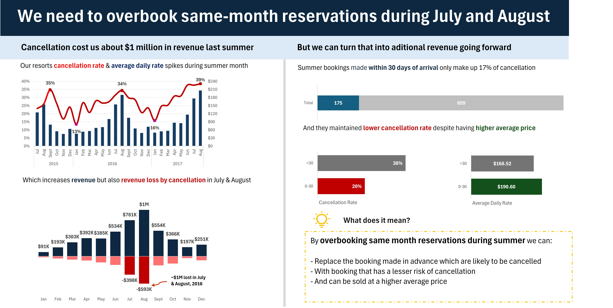

# SHG Hotel — Reservation Cancellations & Revenue Optimization (2015–2017)

> **An exploratory data analysis project** identifying the root causes of ~$1M in peak-season revenue loss and delivering actionable, data-backed recommendations to reduce cancellations and optimize pricing.

---

## Overview

Splendor Hotel Group (SHG) was losing significant revenue during its busiest months — not from lack of demand, but from preventable booking cancellations. This project digs into three years of reservation data to quantify the problem, uncover the patterns driving it, and propose a concrete revenue recovery strategy.

**Key finding:** Advance bookings (made 30+ days before arrival) cancel at nearly double the rate of last-minute bookings — yet generate lower daily revenue. Replacing a portion of summer advance bookings with same-month reservations could recover a significant share of the ~$1M lost in July–August 2016 alone.

---

## Problem Statement

SHG faced three compounding challenges:

- High cancellation rates during peak summer months (July & August)
- Revenue loss from advance bookings that cancel without replacement
- A pricing gap: lower Average Daily Rates on the booking type most likely to cancel

---

## Objectives

- Quantify revenue lost to cancellations, with focus on summer peak periods
- Compare cancellation behavior and pricing between advance vs. same-month bookings
- Identify patterns in Average Daily Rate (ADR) relative to booking lead time
- Recommend a data-driven strategy to reduce risk and maximize revenue

---

## Methodology

### 1. Data Collection & Understanding
- Sourced booking and cancellation records from SHG Hotel Group (2015–2017)
- Key fields: reservation date, arrival date, cancellation status, revenue, and ADR
- Focused analysis on summer months (July & August) due to observed seasonal patterns

### 2. Data Cleaning & Preparation
- Removed duplicates, resolved missing values, and standardized date formats
- Engineered derived features: booking lead time, cancellation flag, revenue loss amount
- Segmented bookings into two categories:
  - **Advance bookings** — made more than 30 days before arrival
  - **Same-month bookings** — made 0–30 days before arrival

### 3. Exploratory Data Analysis (EDA)
- Built pivot tables to analyze cancellation rates by month and booking window
- Compared ADR across cancelled vs. non-cancelled reservations
- Visualized revenue gained vs. revenue lost using charts and dashboards

---

## Key Findings

| Metric | Advance Bookings (>30 days) | Same-Month Bookings (0–30 days) |
|---|---|---|
| Cancellation rate | 38% | 20% |
| Average Daily Rate (ADR) | $168.52 | $190.60 |
| Revenue risk | Higher | Lower |

- Cancellations in July & August 2016 resulted in **~$1M in lost revenue** — approximately **34% of potential peak-season revenue**
- Same-month bookings not only cancel less, they also command a **$22 higher ADR** on average

---

## Recommendations

**Replace high-risk advance summer bookings with same-month reservations.**

In July and August, actively shift the booking mix by:

1. **Implementing a last-minute booking promotion** — targeted offers in the 0–30 day window to fill inventory closer to arrival
2. **Applying strategic overbooking** — accept more advance reservations than available rooms during peak months, calibrated to the 38% cancellation rate, to protect against no-shows
3. **Optimizing pricing by lead time** — review rate structures to better capture the higher ADR that same-month bookers are already willing to pay

---

## Tools Used

| Tool | Purpose |
|---|---|
| Microsoft Excel | Data analysis, pivot tables, calculations |
| Power Query | Data cleaning and transformation |
| Charts & Dashboards | Visualization and storytelling |

---

## Data Dictionary

| Column | Type | Description |
|---|---|---|
| `Nights` | Numeric | Number of nights in the reservation |
| `Guest` | Numeric | Total number of guests in the booking |
| `Distribution Channel` | Categorical | Channel through which the booking was made (e.g. Direct, OTA, Corporate) |
| `Customer Type` | Categorical | Guest segment classification (e.g. Transient, Group, Contract) |
| `Country` | Categorical | Country of origin of the guest |
| `Deposit Type` | Categorical | Deposit status at time of booking (e.g. No Deposit, Non-Refundable, Refundable) |
| `Average Daily Rate` | Numeric | Average nightly room rate for the booking, in USD |
| `Status` | Categorical | Final reservation outcome — either `Checked-Out` or `Cancelled` |
| `Status Update` | Date | Date on which the status (check-out or cancellation) was recorded |
| `Cancelled` | Binary | Cancellation flag — `1` = Cancelled, `0` = Not cancelled |
| `Revenue` | Numeric | Actual revenue realised from the booking, in USD |
| `Revenue Loss` | Numeric | Estimated revenue lost due to cancellation (ADR × Nights, where Cancelled = 1), in USD |

---

## Dashboard Preview

---

## About the Author

This project was completed as part of a data analytics portfolio focused on business intelligence and revenue optimization in the hospitality industry.

Feel free to connect or reach out with questions.

---

*Licensed under the [MIT License](LICENSE)*
